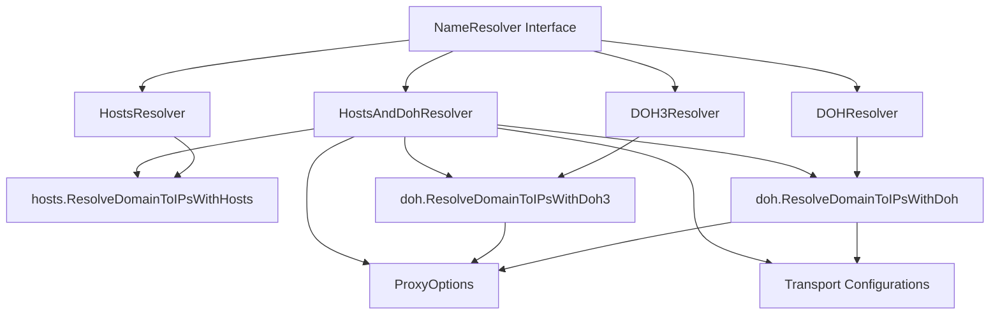

# Resolver 架构说明

## 概述

本项目实现了四种不同的域名解析器（Resolver），它们都实现了 `NameResolver`
接口，提供了统一的域名解析功能。

## NameResolver 接口

```go
type NameResolver interface {
    Resolve(ctx context.Context, name string) (context.Context, net.IP, error)
    LookupIP(ctx context.Context, network, host string) ([]net.IP, error)
}
```

- `Resolve` 方法：返回单个 IP 地址，适用于需要单个 IP 的场景
- `LookupIP` 方法：返回多个 IP 地址，适用于需要多个 IP 的场景

## Resolver 类型

### 1. HostsResolver

**功能**：仅使用本地 hosts 文件进行域名解析

**特点**：

- 不依赖网络连接
- 解析速度快
- 适用于本地开发和测试环境

**创建函数**：

```go
func CreateHostsResolver() NameResolver
```

### 2. DOHResolver

**功能**：使用 DNS over HTTPS (DoH) 进行域名解析

**特点**：

- 支持 HTTP/1.1 和 HTTP/2
- 支持自定义 Transport 配置
- 自动跳过 h3 配置的 ProxyOption
- 随机选择可用的 DoH 服务器

**创建函数**：

```go
func CreateDOHResolver(proxyoptions options.ProxyOptions, tranportConfigurations ...func(*http.Transport) *http.Transport) NameResolver
```

### 3. DOH3Resolver

**功能**：使用 HTTP/3 DNS over HTTPS (DoH3) 进行域名解析

**特点**：

- 仅支持 HTTP/3
- 仅处理 dohalpn="h3" 的 ProxyOption
- 随机选择可用的 DoH3 服务器

**创建函数**：

```go
func CreateDOH3Resolver(proxyoptions options.ProxyOptions) NameResolver
```

### 4. HostsAndDohResolver

**功能**：结合 hosts 文件和 DoH/DoH3 进行域名解析

**特点**：

- 优先使用 hosts 文件解析
- hosts 解析失败时，自动回退到 DoH/DoH3
- 根据 ProxyOption 的 dohalpn 自动选择 DoH 或 DoH3
- 提供最佳的解析体验

**创建函数**：

```go
func CreateHostsAndDohResolver(proxyoptions options.ProxyOptions, tranportConfigurations ...func(*http.Transport) *http.Transport) NameResolver
```

## 架构图



## 解析流程

### HostsAndDohResolver 解析流程

1. **尝试 hosts 解析**
   - 调用 `hosts.ResolveDomainToIPsWithHosts()`
   - 如果成功，返回 IP 地址列表
   - 如果失败，进入下一步

2. **尝试 DoH/DoH3 解析**
   - 随机打乱 ProxyOptions 顺序
   - 遍历每个 ProxyOption：
     - 如果 `dohalpn == "h3"`，使用 DoH3 解析
     - 否则，使用 DoH 解析
   - 如果某个解析成功，返回 IP 地址列表
   - 如果全部失败，返回错误

### DOHResolver 解析流程

1. **检查 ProxyOptions**
   - 如果为空，返回错误

2. **随机打乱 ProxyOptions 顺序**

3. **遍历每个 ProxyOption**
   - 跳过 `dohalpn == "h3"` 的配置
   - 使用 `doh.ResolveDomainToIPsWithDoh()` 解析
   - 如果成功，返回 IP 地址列表
   - 如果失败，记录错误并继续

4. **返回结果**
   - 如果有成功解析，返回 IP 地址列表
   - 如果全部失败，返回错误

### DOH3Resolver 解析流程

1. **检查 ProxyOptions**
   - 如果为空，返回错误

2. **随机打乱 ProxyOptions 顺序**

3. **遍历每个 ProxyOption**
   - 只处理 `dohalpn == "h3"` 的配置
   - 使用 `doh.ResolveDomainToIPsWithDoh3()` 解析
   - 如果成功，返回 IP 地址列表
   - 如果失败，记录错误并继续

4. **返回结果**
   - 如果有成功解析，返回 IP 地址列表
   - 如果全部失败，返回错误

## 使用建议

1. **开发环境**：使用 `HostsResolver`，速度快且不依赖网络
2. **生产环境**：使用 `HostsAndDohResolver`，提供最佳的解析体验和容错能力
3. **仅 DoH 环境**：使用 `DOHResolver`，适用于不支持 HTTP/3 的环境
4. **仅 DoH3 环境**：使用 `DOH3Resolver`，适用于需要 HTTP/3 性能优势的环境

## 错误处理

所有 Resolver 都实现了完善的错误处理机制：

- 解析失败时返回详细的错误信息
- 支持多个解析源的错误聚合
- 提供有意义的错误消息，便于调试
